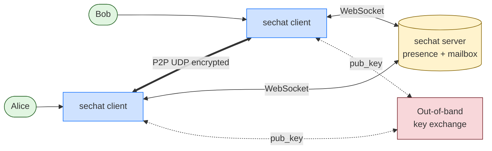
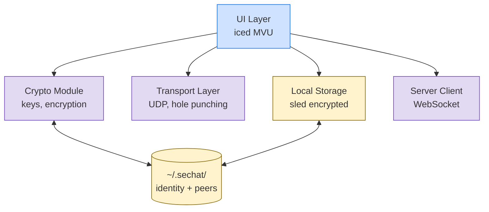
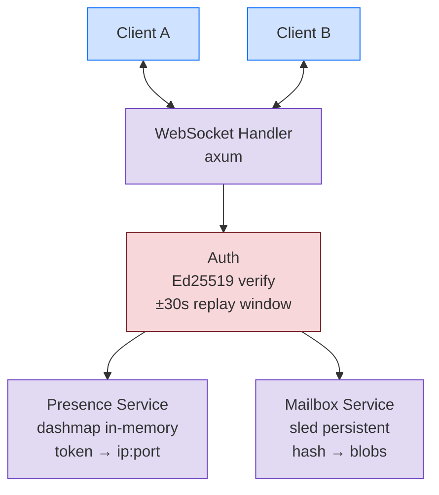
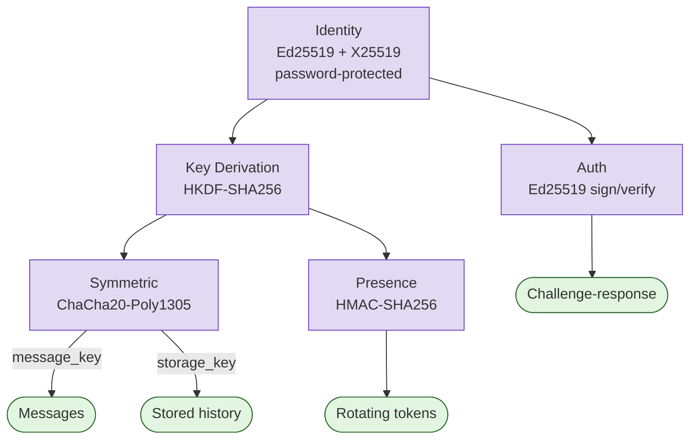
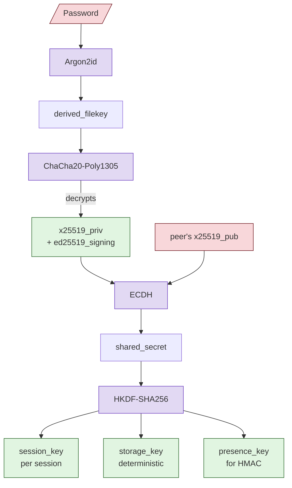
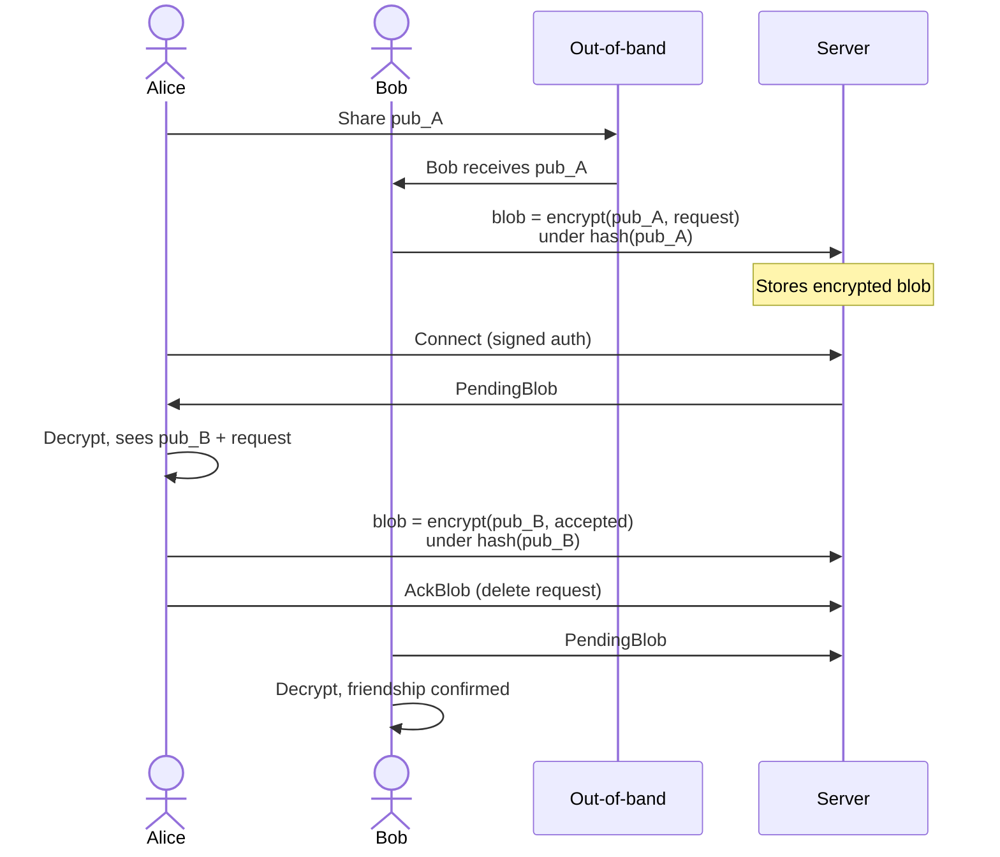
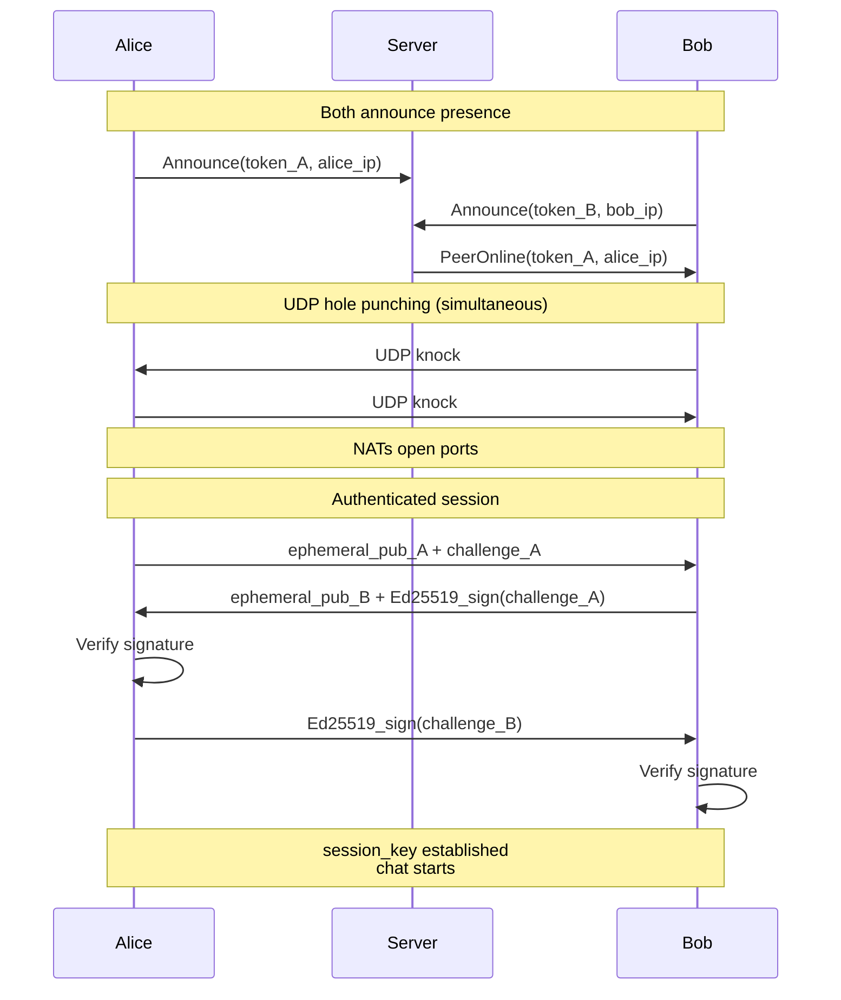
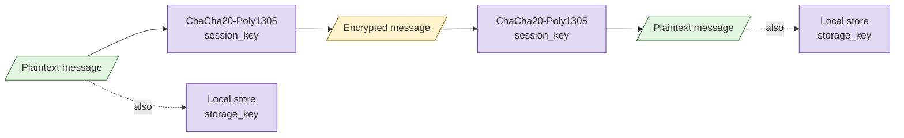
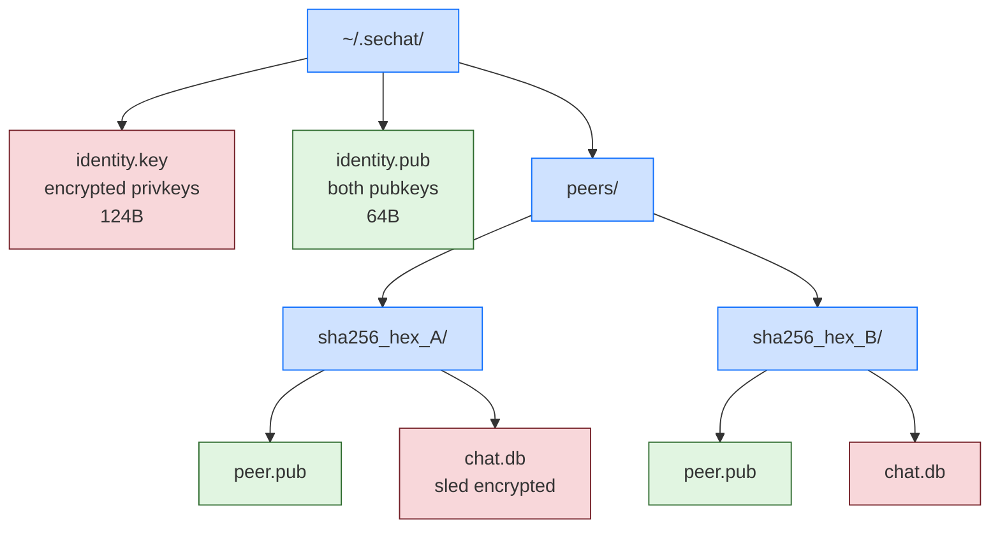

# sechat - Architecture Diagrams

## 1. System Overview

---

## 2. Client Architecture

---

## 3. Server Architecture

---

## 4. Crypto Module

---

## 5. Key Hierarchy

---

## 6. Friend Request Flow

---

## 7. P2P Connection Flow

---

## 8. Message Flow

---

## 9. Filesystem Layout

