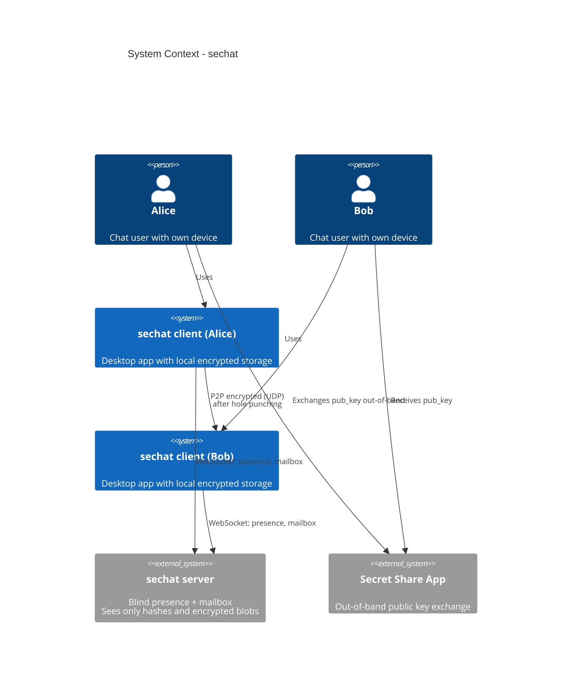
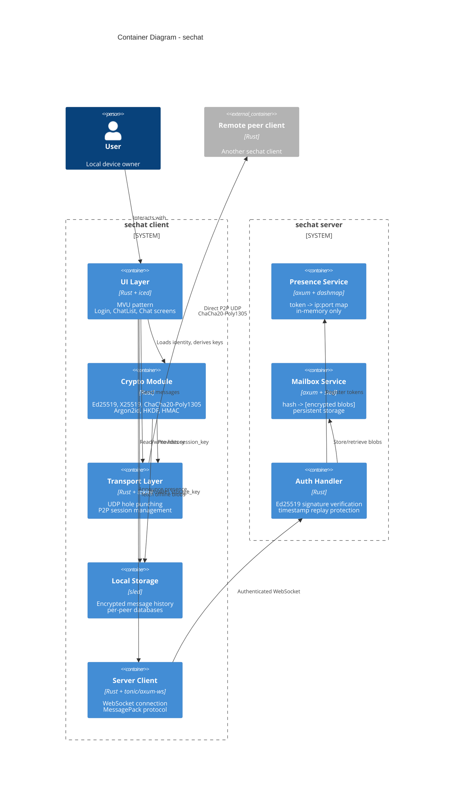
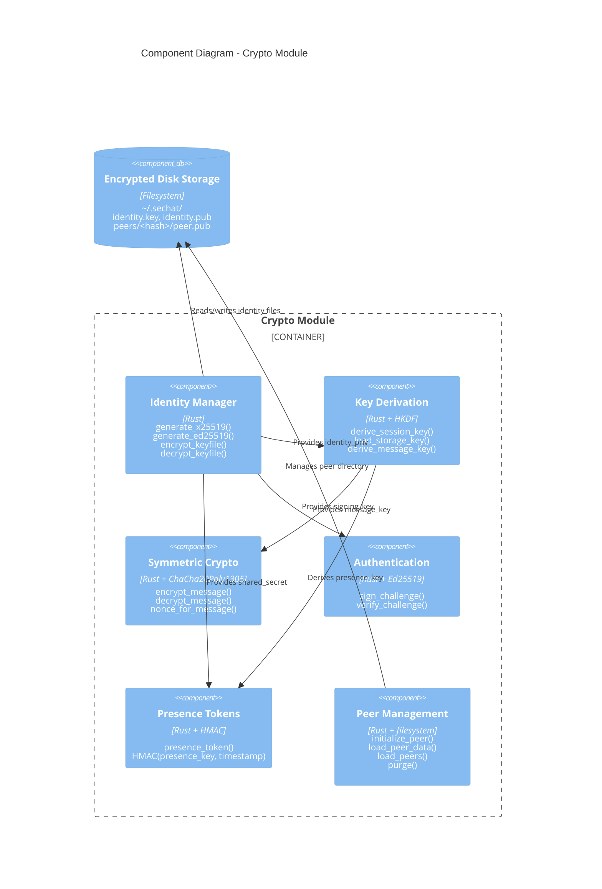
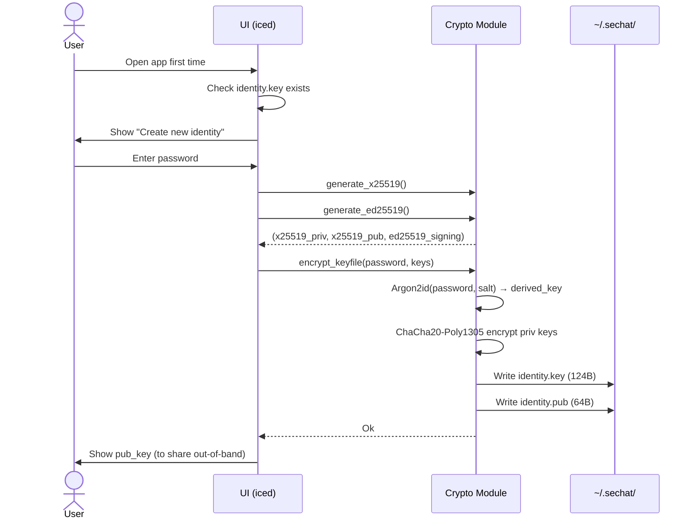
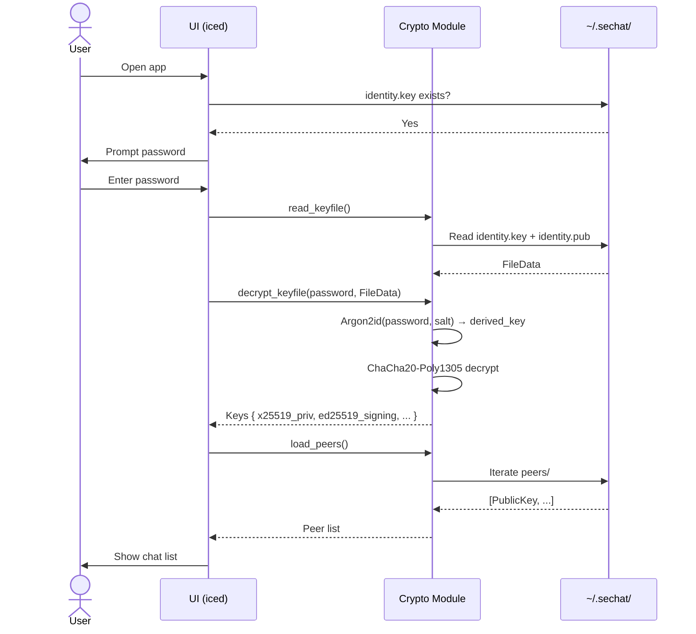
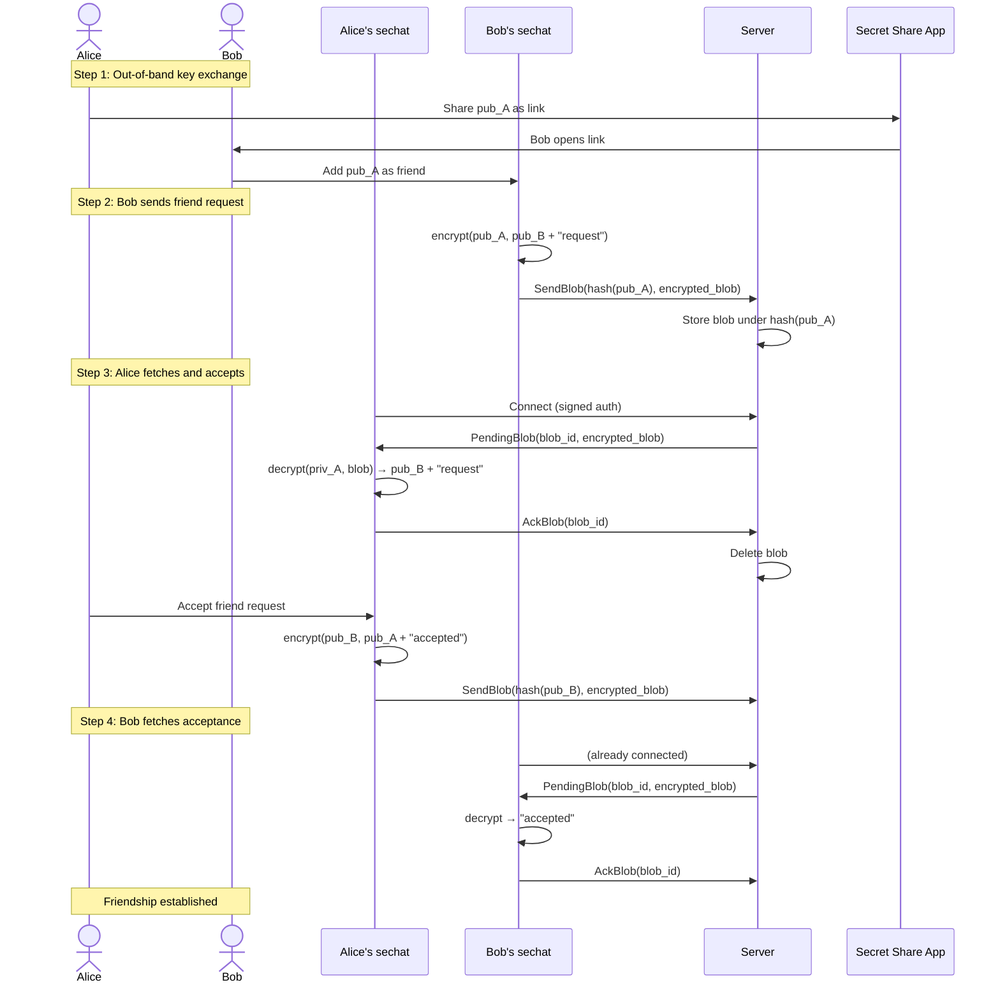
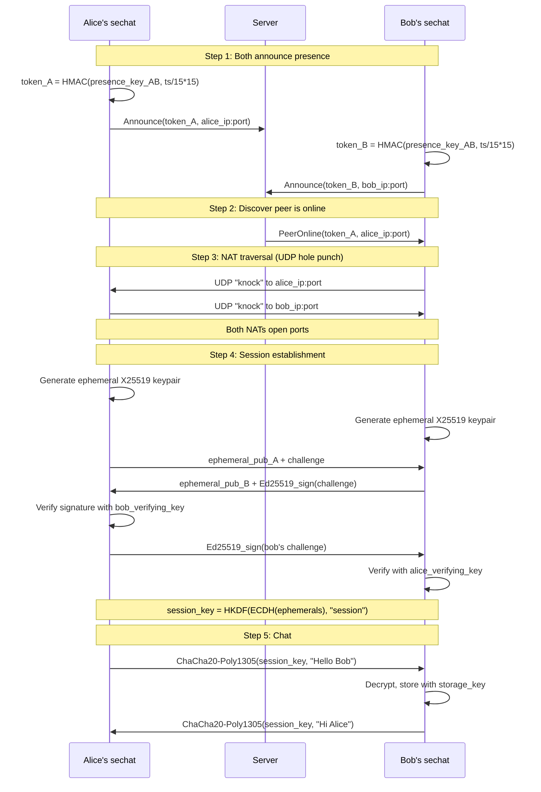
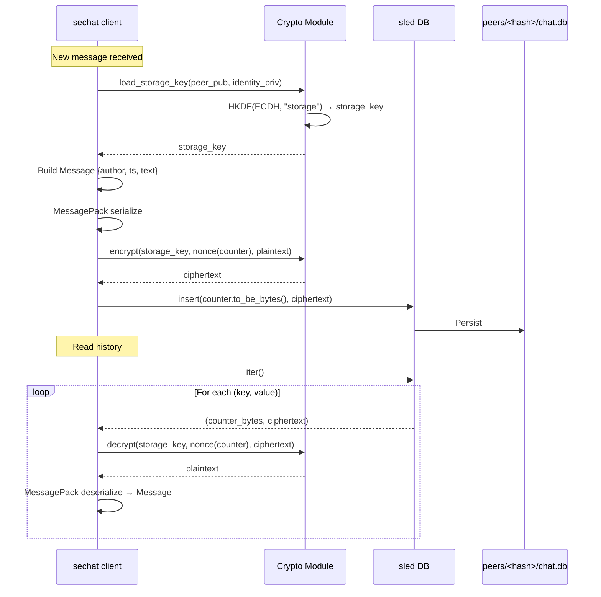
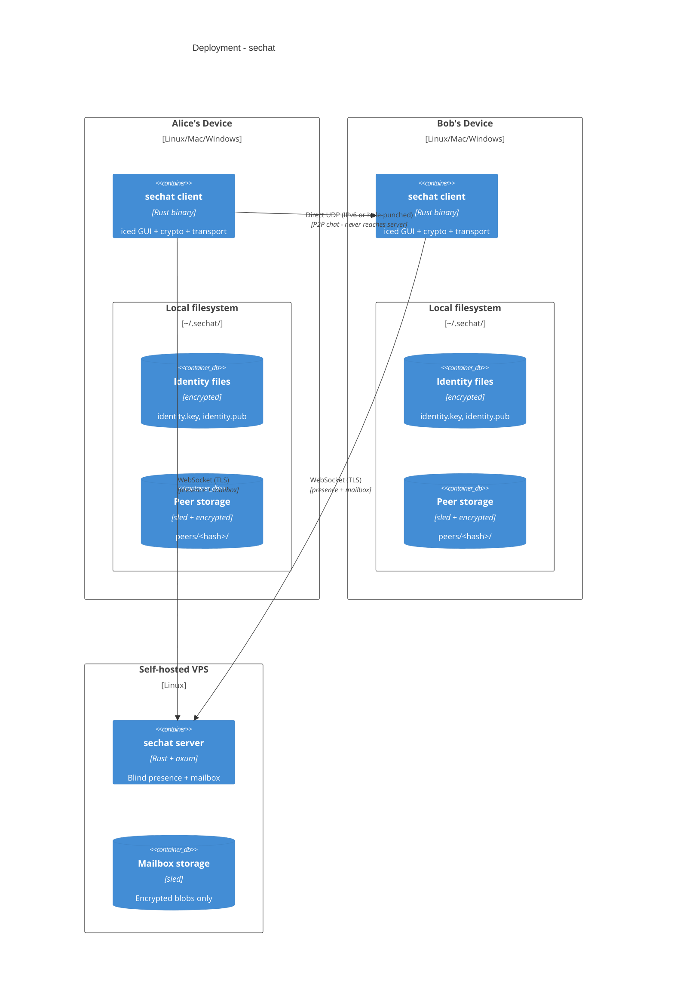

# sechat - C4 Architecture Diagrams

## Level 1: System Context

---

## Level 2: Container Diagram

---

## Level 3: Component Diagram - Crypto Module

---

## Level 4: Code/Sequence Diagrams

### Sequence: First-time Setup

### Sequence: Login Flow

### Sequence: Add Friend (Out-of-Band + Server Mailbox)

### Sequence: P2P Connection & Chat

### Sequence: Message Storage

---

## Deployment Diagram

